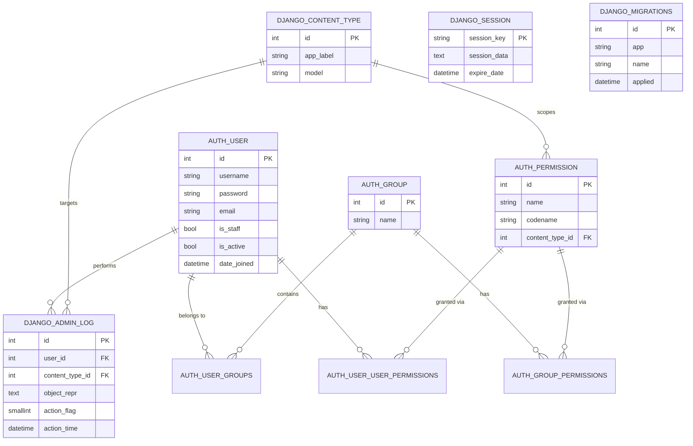

# Database Overview

This document clearly explains the database used by the **PDF Schema Generator** project.

---

## 1. Database Engine

| Property        | Value                                  |
| --------------- | -------------------------------------- |
| Engine          | **SQLite 3**                           |
| File location   | `db.sqlite3` (project root)            |
| Configured in   | `config/settings.py` → `DATABASES`     |
| Django ORM      | Yes (default `django.db.backends.sqlite3`) |

```python
# config/settings.py
DATABASES = {
    "default": {
        "ENGINE": "django.db.backends.sqlite3",
        "NAME": BASE_DIR / "db.sqlite3",
    }
}
```

---

## 2. What the Database Stores

This project is **stateless for its core feature** (PDF → JSON Schema conversion happens entirely in memory). The database is **only** used for Django's built-in machinery.

PDF uploads are written to a temporary OS folder (`tempfile.mkdtemp(...)` in `backend/views.py`) and are **never persisted to the database**.

---

## 3. Tables Present in `db.sqlite3`

These tables are created automatically by `python manage.py migrate` from the apps registered in `INSTALLED_APPS`:

| Table                          | Created by app           | Purpose                                       |
| ------------------------------ | ------------------------ | --------------------------------------------- |
| `django_migrations`            | Django core              | Tracks which migrations have been applied     |
| `django_content_type`          | `contenttypes`           | Generic relations between models              |
| `django_session`               | `sessions`               | Server-side session storage                   |
| `django_admin_log`             | `admin`                  | Audit log of admin-site actions               |
| `auth_user`                    | `auth`                   | User accounts (username, password hash, etc.) |
| `auth_group`                   | `auth`                   | User groups                                   |
| `auth_permission`              | `auth`                   | Permission records                            |
| `auth_user_groups`             | `auth`                   | M2M user ↔ group                              |
| `auth_user_user_permissions`   | `auth`                   | M2M user ↔ permission                         |
| `auth_group_permissions`       | `auth`                   | M2M group ↔ permission                        |
| `sqlite_sequence`              | SQLite internal          | Autoincrement counters                        |

---

## 4. Entity Relationship Diagram



---

## 5. Inspecting the Database

### Option A — Django shell

```bash
python manage.py dbshell
```
Then inside the SQLite prompt:
```sql
.tables
.schema auth_user
SELECT name FROM sqlite_master WHERE type='table';
```

### Option B — One-shot inspection script

```bash
python manage.py inspectdb
```

### Option C — Plain Python

```python
import sqlite3
conn = sqlite3.connect("db.sqlite3")
for row in conn.execute("SELECT name FROM sqlite_master WHERE type='table';"):
    print(row[0])
```

---

## 6. Resetting the Database

```bash
# Delete the file and re-create empty schema
del db.sqlite3          # Windows (cmd)
Remove-Item db.sqlite3  # Windows (PowerShell)
python manage.py migrate
```

---

## 7. Authentication Note

The project uses **JWT** (`djangorestframework-simplejwt`) for API auth. JWTs themselves are **stateless** and are **not stored in the database** — they are signed tokens. The only auth-related rows that may appear are in `auth_user` if users are created via `createsuperuser` or registration endpoints.
